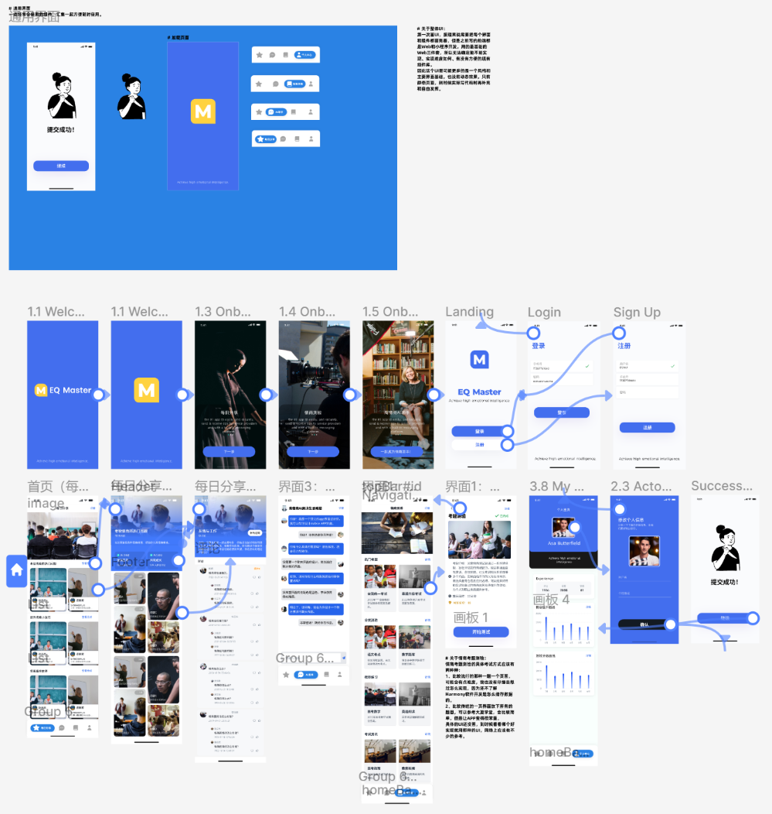

# 情商高手

> 课程：智能移动应用开发
>
> 操作系统：HarmonyOS Next

---

## 项目介绍

[情绪商数](https://zhida.zhihu.com/search?q=情绪商数&zhida_source=entity&is_preview=1)（Emotional Intelligence Quotient，简写成EQ），通常简称为情商，又称为“情绪智力” 、“[情绪智慧](https://zhida.zhihu.com/search?q=情绪智慧&zhida_source=entity&is_preview=1)”或“情绪智商”。

1995年，哈佛大学心理学博士丹尼尔·戈尔曼出版了《情商：为什么[情商比智商更重要](https://zhida.zhihu.com/search?q=情商比智商更重要&zhida_source=entity&is_preview=1)》一书，引起了全球性的EQ研究与讨论，因此，丹尼尔·戈尔曼被誉为“情商之父”。

对于“情商”的概念，[丹尼尔·戈尔曼](https://zhida.zhihu.com/search?q=丹尼尔·戈尔曼&zhida_source=entity&is_preview=1)并没有给出一个精确的定义。这个概念好像至今还没有非常完整确切的定义。就连那些经常把这句话挂在嘴边的心理学家也并没有对其下过确切定义。

情商是一种基本生存能力，它决定了一个人其他心智能力的表现，不懂得情商的人，其身心都是不健全！**在事业取得成功的过程中，80%靠得是情商，20%靠得是智商，良好的情商是获得职场成功的基本素质。**

**我们每天都在与人交流，处理各种人际关系问题，而拥有良好的情商是改善一个人际关系的重要条件。**当一个人面临工作压力、家庭变故、突发事件时，良好的情商是妥善处理一切的必备素质。当我们面对悲伤、失恋、离婚等诸多生活中的不如意时，更需要情商来调适我们自己的身心健康。提升情商使我们能够用有限的知识去运作无限的世界，更适合当前压力过大的生存环境。

**情商对于个人的人生成功、职场顺利和家庭幸福都是至关重要的。**根据戈尔曼教授的研究，童年、青少年时期的家庭环境和教育对于一个人情商的培养十分重要，奠定了一生幸福的基础。所以情商教育越早越好，要融入幼儿园、小学、中学的[教学过程](https://zhida.zhihu.com/search?q=教学过程&zhida_source=entity&is_preview=1)中，这就首先要求提升教师的情商，使他们在从事教育的同时也完成对人的教化。

（上面都是知乎抄的。。。）

由此我们“情商高手”应运而生，通过。。。。。。

（下面就是吹我们项目有多有用。。。解决生活难题、锻炼情商能力。。。）

---

## 功能模块

> <u>情商每日分享</u>和<u>AI高情商回复</u>是基本要求，这两块的基础实现甚至不需要用户个人账号，可以说是工作量很小；<u>情商测验</u>和<u>个人主页</u>是后续有时间可以继续补充，情商测验可以提高APP的趣味性，个人主页也是一个完善的APP不可或缺的一部分（赋予商业价值）。

1. **情商每日分享**（第一阶段）

   - **功能介绍**：每日分享热门的考验情商的问题、提升情商小技巧、情商趣味故事
   - **实现方式**：找资源每日定时发送即可
   - **难点**：资源收集（爬虫）

2. **情商论坛**

   > 后来想了想这部分还是不做了。一是<u>实在老套</u>，写过好多次了；二是确实<u>工作量很多</u>，页面很多，想功能完善会很复杂。吧情商测验来替代这一部分，更有趣也更简单。

   - **功能介绍**：用户分享考验情商的问题，其他用户可以在下面讨论回复（除了自由分享还应有一个主题分享）
   - **实现方式**：论坛
   - **难点**：规范发言（很难）

3. **AI高情商回复**（第一阶段）

   - **功能介绍**：对于用户难以解决的情商难题提供高情商解决方式
   - **实现方式**：智普AI微调（寻找现有训练数据集、Python网络爬虫）
   - **难点**：虽然实现起来没有技术难点，但是AI这个黑盒子最终效果如何难以确定（可以蒙混过关）

4. **个人主页**（第二阶段）

   - **功能介绍**：用户个人信息（修改与显示）、评论记录、考试记录
   - **实现方式**：normal
   - **难点**：数据库设计

5. **情商测验**（第二阶段）

   - **功能介绍**：用户进行情商测验
   - **实现方式**：normal
   - **难点**：资源收集（爬虫）

---

## UI设计

> [学习高情商话术平台 - 即时设计 (js.design)](https://js.design/f/yyXWz9?p=EpOj6yiU4k&mode=design)

---

## 数据库设计

---

## 具体实现
